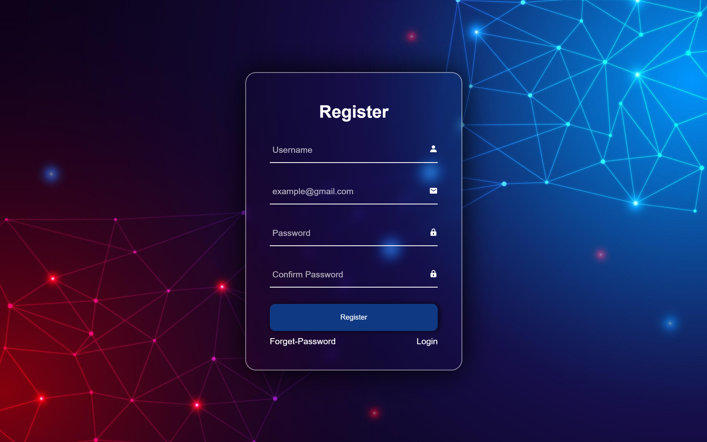

# TECHNOHACKS-REGISTRATION-PAGE

## TASK 6 REGISTRATION PAGE

This repository contains a simple registration for an web application project developed using HTML, CSS, and JavaScript, created as part of my internship at TECHNOHACKS

## Overview:
This project was completed as part of the Web Development internship at TechnoHacks. The task was to create a registration form using HTML, CSS, and JavaScript. The form needed to be designed to collect user information and utilize JavaScript for validation and error handling in the input fields.



## Task Description

The main objectives of this task were as follows:
1. Create an HTML form with fields for user registration, including name, email, password, and confirmation fields.
2. Implement a visually appealing and user-friendly interface using CSS to style the form and make it responsive.
3. Use JavaScript to perform client-side validation on user input:
   - Ensure that all required fields are filled out.
   - Validate the email format.
   - Confirm that the password and confirmation fields match.
   - Display appropriate error messages if validation fails.
4. Submit the form data to a backend (not included in this task) upon successful validation.

## Technologies Used
- HTML5: Used for structuring the registration form.
- CSS3: Applied for styling and responsive design.
- JavaScript: Implemented client-side validation and error handling.
- (Optional) Backend Technology: If applicable, specify the technology used for handling form submissions.


## Usage
- Fill out the registration form with valid and invalid data to test the validation and error handling.
- Observe how error messages are displayed when validation fails.
- Ensure that the form submits successfully upon passing validation (backend implementation required).


## Getting Started

To get started with the Currency Converter web application, follow these steps:

1. Clone the repository to your local machine:

   ```bash
   git clone https://github.com/HariR1893/TECHNOHACKS-REGISTRATION-PAGE.git
   ```
2. Navigate to the project directory:
   `cd TECHNOHACKS-REGISTRATION-PAGE`

3. Start the development server:
    `npm run start`
   
5. The app will open in your default web browser at `http://localhost:3000.`

Feel free to explore and customize this project as you see fit. It's a great way to gain practical experience in web development during your internship at TECHNOHACKS!
